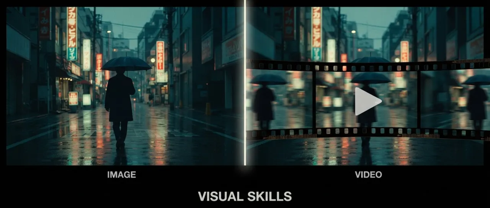
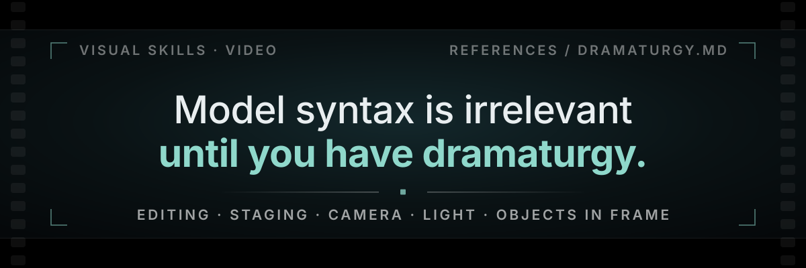

<div align="right"><strong>En</strong> | <a href="README.ru.md">Ru</a></div>

# 🎬 Visual Skills — AI Film Director for Your Movie



[](https://skills.sh/smixs/visual-skills)
[](https://docs.claude.com/en/docs/agents/agent-skills)
[](LICENSE)

Two Claude Skills that turn your agent into a working film crew: `video` writes AI video prompts the way a director, screenwriter and editor would; `image` writes image prompts the way an art director would. Both pick the right model for the task, apply its exact syntax, and return a copy-paste-ready prompt.

Most prompting guides teach you syntax. This one teaches your agent **cinema** — and that is what makes it the strongest tool available for directing AI video.

## Dramaturgy first, syntax second

<div align="center">
  
</div>

> [!IMPORTANT]
> **Model syntax is worth nothing until the dramaturgy is there.** Editing, staging, camera, light, the objects allowed in frame — hard rules, all of them written into the skill. That is what makes it a director instead of an autocomplete for adjectives. Get them right and the model finally has something worth rendering; get them wrong and no amount of correct syntax saves the shot.

The heart of the `video` skill is [`video/references/dramaturgy.md`](video/references/dramaturgy.md) — how films are actually built, compressed into rules an agent can execute on a 5-30 second clip. Same idea, both columns below. Only one of them can be filmed.

<div align="center">

<table>
<tr>
<th width="290" align="left">The prompt everyone writes<br><sub>four adjectives, zero facts</sub></th>
<th width="500" align="left">The prompt the skill writes<br><sub>one emotion · three shots · three details · one final image</sub></th>
</tr>
<tr>
<td width="290" valign="top">

```text
cinematic shot of a man
in a kitchen at night,
epic lighting, moody
atmosphere, 4k
```

</td>
<td width="500" valign="top">

```text
Emotion: hunger as loneliness. Object: last sausage.
Final image: fridge light dying on his face.

Shot 1 · 0.0-1.6s · wide, 24mm, static
Dark kitchen. He stands with one hand on the fridge
door, not opening it. Only the wall clock moves.

Cut · 1.6-3.4s · medium, 50mm, push-in
The push starts the frame he sees the shelf is empty
— that is what changed. Cold blue light, jaw sets,
one stomach growl, then nothing.

Cut · 3.4-5.0s · macro, 100mm
Two fingers close on the last sausage. Half-beat hold.
Door swings shut, the light dies on his face.
```

</td>
</tr>
<tr>
<td width="290" valign="top">

<sub>No desire, no obstacle, no geometry, no cut, no final image. The model picks all five for you — and picks differently on every run.</sub>

</td>
<td width="500" valign="top">

<sub>Every line is a physical fact a camera could record: a reason for the move, a body carrying the emotion, a sound, an object, an ending. Nothing left for the model to invent.</sub>

</td>
</tr>
</table>

</div>

> [!CAUTION]
> **Banned everywhere:** `cinematic` · `epic` · `stunning` · `masterpiece` · `beautiful lighting` · `dynamic camera` · `he is sad`. Each one is a placeholder for a detail the writer failed to invent, and not one of them renders.

<div align="center"><sub><b>S&nbsp;E&nbsp;V&nbsp;E&nbsp;N&nbsp;&nbsp;&nbsp;L&nbsp;A&nbsp;W&nbsp;S&nbsp;,&nbsp;&nbsp;&nbsp;N&nbsp;O&nbsp;N&nbsp;E&nbsp;&nbsp;&nbsp;O&nbsp;P&nbsp;T&nbsp;I&nbsp;O&nbsp;N&nbsp;A&nbsp;L</b></sub></div>

<div align="center">

<table>
<tr>
<td width="385" valign="top">

<sub><b>0&nbsp;1&nbsp;&nbsp;·&nbsp;&nbsp;L&nbsp;A&nbsp;W</b></sub><br><b>The scene formula</b>

<code>desire + obstacle + geometry + gaze + rhythm</code>

Five elements. Name each one in a single sentence before a word of prompt is written: what the hero wants right now, what blocks it, who stands where, where the eye is forced to look, how long each shot lives. Anything less is decoration.

</td>
<td width="385" valign="top">

<sub><b>0&nbsp;2&nbsp;&nbsp;·&nbsp;&nbsp;D&nbsp;E&nbsp;T&nbsp;A&nbsp;I&nbsp;L</b></sub><br><b>The Details Law</b>

Every shot owns three physical facts: one <b>environmental pressure</b> (cold refrigerator light, wet asphalt), one <b>micro-action of the body</b> (jaw locks, knuckles whiten), one <b>sound anchor or visual motif</b>.

"He is sad" does not render. A jaw does.

</td>
</tr>
<tr>
<td colspan="2" valign="top">

<sub><b>0&nbsp;3&nbsp;&nbsp;·&nbsp;&nbsp;E&nbsp;D&nbsp;I&nbsp;T&nbsp;I&nbsp;N&nbsp;G</b></sub><br><b>Walter Murch's Rule of Six</b> — where to cut, in priority order. Each item outweighs everything below it combined.

<pre>
emotion       51%  █████████████████████████▌
story         23%  ███████████▌
rhythm        10%  █████
eye-trace      7%  ███▌
screen plane   5%  ██▌
3D space       4%  ██
</pre>

Cutting "for pace" is item three. Serving item three ahead of emotion and story is exactly how TikTok mush gets made — and it is the default behaviour of every model you will ever prompt.

</td>
</tr>
<tr>
<td width="385" valign="top">

<sub><b>0&nbsp;4&nbsp;&nbsp;·&nbsp;&nbsp;S&nbsp;E&nbsp;L&nbsp;E&nbsp;C&nbsp;T&nbsp;I&nbsp;O&nbsp;N</b></sub><br><b>The three-jobs rule</b>

A shot either changes emotion, advances action, or increases pressure. A shot that does none is deleted, however pretty it came out.

"Beautiful establishing shot" is not a job.

</td>
<td width="385" valign="top">

<sub><b>0&nbsp;5&nbsp;&nbsp;·&nbsp;&nbsp;S&nbsp;T&nbsp;A&nbsp;G&nbsp;I&nbsp;N&nbsp;G</b></sub><br><b>Blocking, camera, environment</b>

<b>Fincher</b> — every camera move answers "what changed?", otherwise the camera is static. <b>Spielberg</b> — even in chaos the viewer knows where the hero, the threat and the exit are. <b>Kurosawa</b> — one weather, one pressure, carrying the whole scene.

</td>
</tr>
<tr>
<td width="385" valign="top">

<sub><b>0&nbsp;6&nbsp;&nbsp;·&nbsp;&nbsp;R&nbsp;H&nbsp;Y&nbsp;T&nbsp;H&nbsp;M</b></sub><br><b>Montage is a staircase</b>

<code>long → shorter → shorter → pause → impact</code>

The pause before the hit matters more than the speed of the cuts. Beat maps for 15 / 30 / 60 / 90 seconds — Hook, Pressure, Crack, Impact, Aftermath. Never skip the Crack.

</td>
<td width="385" valign="top">

<sub><b>0&nbsp;7&nbsp;&nbsp;·&nbsp;&nbsp;S&nbsp;P&nbsp;E&nbsp;C</b></sub><br><b>The shot card and the five anchors</b>

Fourteen fields per storyboard row: framing, composition, camera, movement reason, eye-trace, duration, cut type, sound, light. An empty field is missing direction. Per piece, exactly five anchors — one emotion, one motif, one object, one break, one final image.

</td>
</tr>
</table>

</div>

None of this is advice the agent is free to skip. `dramaturgy.md` loads before any model file, and the output is gated twice on the way out — the six-point dramaturgy check and a three-detail audit on every shot. A prompt that fails either one is not returned.

<div align="center"><sub><b>Six-point check before any prompt leaves the skill</b><br>scene formula &nbsp;·&nbsp; three details &nbsp;·&nbsp; three jobs &nbsp;·&nbsp; motivated camera &nbsp;·&nbsp; readable geometry &nbsp;·&nbsp; five anchors<br>Fail one, it does not ship. &nbsp;&nbsp;→&nbsp;&nbsp; <a href="video/references/dramaturgy.md">read the full layer</a></sub></div>

## Supported models

<div align="center">

<table>
  <tr>
    <th colspan="6" align="center"><sub>VIDEO · DEDICATED MODEL FILE, EXACT SYNTAX</sub></th>
  </tr>
  <tr>
    <td colspan="2" align="center" width="240"><a href="video/references/seedance.md"><br><b>Seedance</b></a><br><sub>1.0 · 1.5 Pro · 2.0 · 2.0 Mini · 2.5</sub></td>
    <td colspan="2" align="center" width="240"><a href="video/references/kling.md"><br><b>Kling</b></a><br><sub>1.6 – 2.6 Pro · 3.0 · Turbo · Omni</sub></td>
    <td colspan="2" align="center" width="240"><a href="video/references/veo.md"><br><b>Veo</b></a><br><sub>3 · 3.1</sub></td>
  </tr>
  <tr>
    <th colspan="6" align="center"><sub>IMAGE · DEDICATED MODEL FILE, EXACT SYNTAX</sub></th>
  </tr>
  <tr>
    <td colspan="3" align="center" width="360"><a href="image/references/nano-banana.md"><br><b>Nano Banana</b></a><br><sub>2 Lite · 2 · Pro <em>(Gemini image family)</em></sub></td>
    <td colspan="3" align="center" width="360"><a href="image/references/gpt-image.md"><picture><source media="(prefers-color-scheme: dark)" srcset="assets/logos/openai-dark.svg"></picture><br><b>GPT Image</b></a><br><sub>2 · legacy 1.5 / 1 / mini</sub></td>
  </tr>
  <tr>
    <th colspan="6" align="center"><sub>COVERED BY THE <a href="video/references/universal-rules.md">UNIVERSAL-RULES</a> LAYER</sub></th>
  </tr>
  <tr>
    <td colspan="6" align="center">
      <picture><source media="(prefers-color-scheme: dark)" srcset="assets/logos/runway-dark.svg"></picture> <b>Runway</b> <sub>Gen-4</sub>
      &nbsp;&nbsp;
      <picture><source media="(prefers-color-scheme: dark)" srcset="assets/logos/luma-color-dark.svg"></picture> <b>Luma</b>
      &nbsp;&nbsp;
      <picture><source media="(prefers-color-scheme: dark)" srcset="assets/logos/pika-dark.svg"></picture> <b>Pika</b>
      &nbsp;&nbsp;
      <picture></picture> <b>Sora</b>
    </td>
  </tr>
</table>

</div>

Model files are updated as new versions ship — Seedance 2.5 has a dedicated production reference built from ByteDance's official guides of July 31, 2026 (30-second single-pass clips, 60s extension, 30-180s Ultra Long mode, 50 reference inputs, video editing, 3D camera blockout); Kling 3.0 Turbo and Omni and Nano Banana 2 Lite are already in.

## How the video skill works

The `SKILL.md` body is a thin router; the craft lives in reference files the agent is forced to load in order:

1. **Dramaturgy** (`dramaturgy.md`) — scene formula, beats, shot functions, rhythm.
2. **Universal rules** (`universal-rules.md`) — the 12 rules that hold for every model: prompt skeleton, character anchors, show-don't-tell, duration discipline, the final-image rule.
3. **One model file** — `seedance.md`, `kling.md` or `veo.md`: exact syntax, multi-shot markers, dialogue protocols, reference tags, failure modes with fixes.
4. **Task modules when needed** — storyboards and role modes, animatic keyframes, race-and-speed grammar, genre patterns, prompt-fix skeletons, camera and lighting vocabulary.
5. **Two mandatory checks before output** — the six-point dramaturgy check and the three-detail audit on every shot. A prompt that fails either does not ship.

Output formats: a single prompt, a stitched multi-clip sequence with continuity blocks, a storyboard table, a prompt audit ("what breaks, what's missing, stronger version"), a director treatment, or Veo JSON.

## What the image skill does

Art direction for still images: editorial and product photography, posters, UI mockups, infographics, edits with hard preservation, character continuity across a series, storyboards and animatic keyframes for the video pipeline. It picks between Nano Banana and GPT Image 2 per task (grounding of real places, extreme aspect ratios and cheap batches go to Nano Banana; dense text, brand assets and preservation-critical edits go to GPT Image 2), then writes the prompt in that model's native structure.

The two skills chain: `image` builds the character sheets and keyframes, `video` turns them into motion with a proper motion brief instead of a re-described scene.

## Works with creative-director

These skills shoot the film. The idea and the script come from their sibling skill — **[creative-director](https://github.com/smixs/creative-director-skill)**: an AI creative director that develops ideas and scripts for commercials (and far beyond advertising) with world-class ideation methodologies, recursive scoring and a library of 571 legendary campaigns.

The full pipeline: **idea & script ([creative-director](https://github.com/smixs/creative-director-skill)) → keyframes & stills (`image`) → motion (`video`)**. Each stage is optional — enter wherever your project starts.

## Install

Works in Claude Code, Claude.ai Projects, Cursor, Windsurf, Cline, OpenCode, Codex, Hermes — anything that reads the Agent Skills format (plain markdown, no lock-in).

**Via [skills.sh](https://skills.sh/smixs/visual-skills)** — installs into any of 70+ supported agents, Codex included:

```bash
npx skills add smixs/visual-skills          # asks where to install, offers both skills
npx skills add smixs/visual-skills -g       # globally, for all projects
npx skills add smixs/visual-skills@video    # just one of the two
npx skills update                           # update to latest
```

**The full Creative Agency pack** — `creative-director`, `image` and `video` in one command:

```bash
npx skills add https://skills.sh/p/nuK9jo3sTCZGB2Ul
```

**As a Claude Code plugin** — one managed bundle with both skills:

```
/plugin marketplace add smixs/visual-skills
/plugin install visual-skills@visual-skills
```

**In Codex CLI** — `npx skills add smixs/visual-skills -g -a codex`, or ask the built-in installer: `$skill-installer install skills from https://github.com/smixs/visual-skills`.

**Manually:**

```bash
git clone https://github.com/smixs/visual-skills.git
cp -r visual-skills/video visual-skills/image ~/.claude/skills/
```

## Usage

> "Write a Seedance prompt — a hungry guy at night finds the last sausage in the fridge, 5 seconds, multi-shot"

> "Storyboard a 30-second film about guilt. Core emotion — guilt. Anchor object — a phone with an unread message."

> "Audit this prompt: [...]. What's broken, how to fix?"

> "Translate this script into 6 × 5-second Seedance prompts."

> "Make a keyframe set for a 15-second product film, then Kling prompts to animate each"

## What's new

<details>
<summary><b>2026-08-04 — Seedance 2.5 production reference</b></summary>

New [`video/references/seedance-25.md`](video/references/seedance-25.md), built from ByteDance's official User Guide and Prompt Guide (released July 31): the official prompt formulas, the `( ) < > { } 【 】` audio/dialogue/text markers, the 50-slot reference discipline with stability tables, stages + end states for 30-second single-pass clips, video editing (partial re-render), extension to 60s, Ultra Long mode (30–180s), the 3D-blockout / green-screen pipeline, and three official worked examples. Cross-model additions landed too: a transition vocabulary and an uncommon-term translation pattern in the camera file, reference-role discipline and priority declaration in the universal rules.

</details>

## Author

**Serge Shima** — [t.me/aimastersme](https://t.me/aimastersme) · [sergeshima.com](https://sergeshima.com) · [aimasters.me](https://aimasters.me)

## Credits

Dramaturgy distilled from Walter Murch (*In the Blink of an Eye*), Akira Kurosawa, David Fincher, Steven Spielberg, Jonathan Glazer and Bong Joon Ho. Model syntax verified against official ByteDance, Kuaishou, Google and OpenAI docs plus fal.ai prompting guides, July 2026.

Vendor marks in the model table come from [lobe-icons](https://github.com/lobehub/lobe-icons) (MIT). Each mark stays the property of its owner and is used here only to identify the model it labels.

## License

**CC BY 4.0** — use it, fork it, build on it, commercially too. One rule: **credit the author**. Any copy or derivative — including skills assembled by AI agents from these files — must keep the attribution line: *Serge Shima — [github.com/smixs/visual-skills](https://github.com/smixs/visual-skills)*. See [LICENSE](LICENSE) and [NOTICE](NOTICE).

**Tags:** `claude` · `claude-skills` · `ai-video-generation` · `ai-image-generation` · `seedance` · `kling` · `veo` · `nano-banana` · `gpt-image-2` · `ai-film-directing` · `storyboard` · `prompt-engineering`
