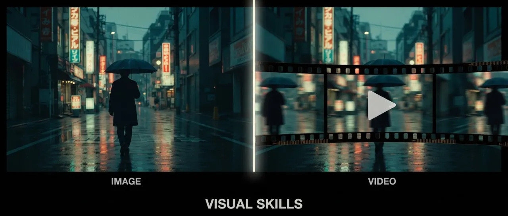

# 🎬 Visual Skills - AI-кинорежиссёр для вашего агента



[](https://docs.claude.com/en/docs/agents/agent-skills)
[](LICENSE)

**🇬🇧 [Read in English](README.md)**

Два Claude-скилла, которые превращают агента в съёмочную группу. `video` пишет промпты для AI-видео как режиссёр, сценарист и монтажёр в одном лице. `image` пишет промпты для картинок как арт-директор. Оба сами выбирают модель под задачу, применяют её точный синтаксис и возвращают готовый к копированию промпт.

Большинство гайдов по промптингу учат синтаксису. Этот скилл учит агента кино - поэтому для режиссуры AI-видео сильнее инструмента сейчас нет. Красивый кадр без драматургии остаётся обоями. Модель рендерит пиксели, режиссирует их скилл.

## Поддерживаемые модели

**Видео:** Seedance 1.0 / 1.5 Pro / 2.0 / 2.0 Mini / 2.5 · Kling 1.6 - 2.6 Pro, Kling 3.0 / 3.0 Turbo / 3.0 Omni · Veo 3 / 3.1. Runway Gen-4, Luma, Pika и Sora закрыты слоем универсальных правил.

**Картинки:** Nano Banana 2 Lite / Nano Banana 2 / Nano Banana Pro (семейство Gemini) · GPT Image 2 (плюс legacy 1.5 / 1 / mini).

Файлы моделей обновляются по мере релизов: Seedance 2.5 (30-секундный клип одной генерацией, 50 референсов, 3D-блокаут камеры), Kling 3.0 Turbo и Omni, Nano Banana 2 Lite уже внутри.

## Сначала драматургия, потом синтаксис

Сердце скилла `video` - файл `references/dramaturgy.md`: выжимка того, как реально строится большое кино, адаптированная под AI-клипы на 5-30 секунд.

- **Формула сцены.** Сцена существует, только когда есть все пять элементов: желание героя, препятствие, геометрия пространства, управляемый взгляд зрителя и ритм монтажа. Всё остальное - декорация.
- **Закон деталей.** Каждый кадр обязан нести три физические детали: давление среды (холодный свет холодильника, мокрый асфальт), микродействие тела (сжалась челюсть, побелели костяшки) и звуковой якорь или визуальный мотив. Эмоция, названная словом без тела, не рендерится.
- **Правило шести Уолтера Мёрча.** Куда падает склейка, по приоритету: эмоция 51%, история 23%, ритм 10%, траектория взгляда 7%, плоскость экрана 5%, 3D-пространство 4%. Резать «ради динамики» - это пункт третий; ставить его выше эмоции и истории - так и получается тиктоковый фарш.
- **Правило трёх работ.** Каждый кадр либо меняет эмоцию, либо двигает действие, либо наращивает давление. Кадр, который не делает ничего из этого, удаляется, каким бы красивым ни был.
- **Блокинг и мизансцена.** Мотивированная камера Финчера (каждое движение отвечает на вопрос «что изменилось?»), пространственная ясность Спилберга (даже в хаосе зритель знает, где герой, где угроза и куда выход), среда как персонаж у Куросавы (одна погода, одно давление - и оно несёт эмоцию сцены).
- **Монтаж как ритм.** Лестница ритма: длинный кадр, короче, ещё короче, пауза, удар. Пауза перед ударом важнее скорости склеек. Карты битов на 15 / 30 / 60 / 90 секунд: Hook, Pressure, Crack, Impact, Aftermath.
- **Карточка кадра на 14 полей и пять якорей.** Каждая строка раскадровки несёт крупность, камеру, причину движения, траекторию взгляда, тип склейки, звук и свет. Каждый ролик держится на одной эмоции, одном мотиве, одном предмете, одном сломе и одном финальном кадре.

Забанено везде: «cinematic», «epic», «stunning», «masterpiece», «beautiful lighting». Каждое из этих слов - заглушка на месте детали, которую автор поленился придумать. И ни одно из них не рендерится.

## Как работает скилл video

`SKILL.md` - тонкий роутер, ремесло живёт в референс-файлах, которые агент обязан загрузить по порядку:

1. **Драматургия** (`dramaturgy.md`) - формула сцены, биты, функции кадров, ритм.
2. **Универсальные правила** (`universal-rules.md`) - 12 правил для любой модели: скелет промпта, якоря персонажа, show-don't-tell, дисциплина длительности, правило финального кадра.
3. **Один файл модели** - `seedance.md`, `kling.md` или `veo.md`: точный синтаксис, маркеры мульти-шота, протоколы диалогов, теги референсов, типовые поломки с фиксами.
4. **Модули под задачу** - раскадровки и режимы ролей, кейфреймы для аниматиков, грамматика гонок и скорости, жанровые паттерны, скелеты для починки промптов, словарь камеры и света.
5. **Две обязательные проверки перед выдачей** - шестипунктовый чек драматургии и аудит трёх деталей по каждому кадру. Промпт, который их не прошёл, пользователю не уходит.

Форматы на выходе: одиночный промпт, серия промптов для склейки с блоками непрерывности, таблица-раскадровка, аудит чужого промпта («что ломает генерацию, чего не хватает, усиленная версия»), режиссёрский тритмент или JSON для Veo.

## Что делает скилл image

Арт-дирекшн для статики: editorial и продуктовая съёмка, постеры, UI-моки, инфографика, правки с жёстким сохранением исходника, консистентность персонажа в серии, раскадровки и кейфреймы для видео-пайплайна. Скилл сам выбирает между Nano Banana и GPT Image 2 (реальные места, экстремальные пропорции и дешёвые батчи уходят в Nano Banana; плотный текст, брендовые ассеты и правки с сохранением - в GPT Image 2) и пишет промпт в родной структуре выбранной модели.

Скиллы работают в связке: `image` собирает character sheet и кейфреймы, `video` оживляет их через motion brief, а не через пересказ сцены заново.

## Установка

Работает в Claude Code, Claude.ai Projects, Cursor, Windsurf, Cline, OpenCode, Hermes - везде, где читается формат Claude Skill (обычный markdown, без привязки к платформе).

```bash
git clone https://github.com/smixs/visual-skills.git
cp -r visual-skills/video visual-skills/image ~/.claude/skills/
```

Или поставьте упакованные архивы: `claude install video.skill` / `claude install image.skill`.

## Использование

> «Напиши промпт для Seedance - голодный мужик ночью находит последнюю сосиску в холодильнике, 5 секунд, мульти-шот»

> «Раскадруй 30-секундный ролик про чувство вины. Главная эмоция - guilt. Опорный объект - телефон с непрочитанным сообщением»

> «Вот мой промпт: [...]. Что сломано, как починить?»

> «Переведи этот сценарий в 6 промптов для Seedance по 5 секунд»

> «Собери кейфреймы для 15-секундного продуктового ролика, потом промпты Kling на оживление каждого»

## Автор

**Сергей Шима** - [t.me/aimastersme](https://t.me/aimastersme) · [sergeshima.com](https://sergeshima.com) · [aimasters.me](https://aimasters.me)

## Источники

Драматургия дистиллирована из Уолтера Мёрча («In the Blink of an Eye»), Акиры Куросавы, Дэвида Финчера, Стивена Спилберга, Джонатана Глейзера и Пон Джун-хо. Синтаксис моделей сверен с официальной документацией ByteDance, Kuaishou, Google и OpenAI и промпт-гайдами fal.ai, июль 2026.

## Лицензия

**CC BY 4.0** - используйте, форкайте, стройте своё, в том числе коммерчески. Одно жёсткое правило: **указывайте автора**. Любая копия или производная, включая скиллы, собранные AI-агентами из этих файлов, обязана сохранить строку атрибуции: *Serge Shima - [github.com/smixs/visual-skills](https://github.com/smixs/visual-skills)*. Подробности в [LICENSE](LICENSE) и [NOTICE](NOTICE).

**Теги:** `claude` · `claude-skills` · `ai-video-generation` · `ai-image-generation` · `seedance` · `kling` · `veo` · `nano-banana` · `gpt-image-2` · `ai-film-directing` · `storyboard` · `prompt-engineering`
