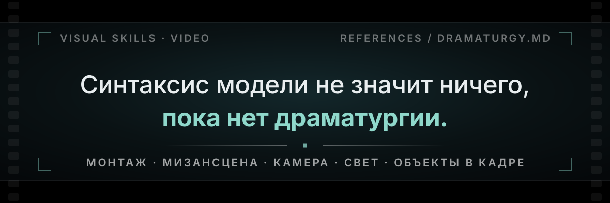

<div align="right"><a href="README.md">En</a> | <strong>Ru</strong></div>

# 🎬 Visual Skills - AI-кинорежиссёр для вашего фильма


[](https://skills.sh/smixs/visual-skills)
[](https://docs.claude.com/en/docs/agents/agent-skills)
[](LICENSE)

Два Claude-скилла, которые превращают агента в съёмочную группу. `video` пишет промпты для AI-видео как режиссёр, сценарист и монтажёр в одном лице. `image` пишет промпты для картинок как арт-директор. Оба сами выбирают модель под задачу, применяют её точный синтаксис и возвращают готовый к копированию промпт.

Большинство гайдов по промптингу учат синтаксису. Этот скилл учит агента кино - поэтому для режиссуры AI-видео сильнее инструмента сейчас нет.

## Сначала драматургия, потом синтаксис

<div align="center">
  
</div>

> [!IMPORTANT]
> **Синтаксис модели не стоит ничего, пока нет драматургии.** Монтаж, мизансцена, камера, свет, объекты, которым разрешено быть в кадре - это жёсткие правила, и все они прописаны в скилле. Именно поэтому он режиссёр, а не автодополнение прилагательных. Сделали правильно - модели наконец есть что рендерить. Сделали неправильно - никакой безупречный синтаксис кадр не спасёт.

Сердце скилла `video` - файл [`video/references/dramaturgy.md`](video/references/dramaturgy.md): как на самом деле строится кино, сжатое до правил, которые агент может выполнить на клипе 5-30 секунд. Ниже одна и та же идея в двух колонках. Снять можно только одну.

<div align="center">

<table>
<tr>
<th width="290" align="left">Промпт, который пишут все<br><sub>четыре прилагательных, ноль фактов</sub></th>
<th width="500" align="left">Промпт, который пишет скилл<br><sub>одна эмоция · три кадра · три детали · один финальный кадр</sub></th>
</tr>
<tr>
<td width="290" valign="top">

```text
cinematic shot of a man
in a kitchen at night,
epic lighting, moody
atmosphere, 4k
```

</td>
<td width="500" valign="top">

```text
Emotion: hunger as loneliness. Object: last sausage.
Final image: fridge light dying on his face.

Shot 1 · 0.0-1.6s · wide, 24mm, static
Dark kitchen. He stands with one hand on the fridge
door, not opening it. Only the wall clock moves.

Cut · 1.6-3.4s · medium, 50mm, push-in
The push starts the frame he sees the shelf is empty
— that is what changed. Cold blue light, jaw sets,
one stomach growl, then nothing.

Cut · 3.4-5.0s · macro, 100mm
Two fingers close on the last sausage. Half-beat hold.
Door swings shut, the light dies on his face.
```

</td>
</tr>
<tr>
<td width="290" valign="top">

<sub>Ни желания, ни препятствия, ни геометрии, ни склейки, ни финального кадра. Все пять пунктов модель выберет за вас - и каждый раз по-новому.</sub>

</td>
<td width="500" valign="top">

<sub>Каждая строка - физический факт, который камера могла бы записать: причина движения, тело, несущее эмоцию, звук, предмет, финал. Модели нечего додумывать.</sub>

</td>
</tr>
</table>

</div>

> [!CAUTION]
> **Забанено везде:** `cinematic` · `epic` · `stunning` · `masterpiece` · `beautiful lighting` · `dynamic camera` · `он грустит`. Каждое из них - заглушка на месте детали, которую автор поленился придумать, и ни одно из них не рендерится.

<div align="center"><sub><b>С&nbsp;Е&nbsp;М&nbsp;Ь&nbsp;&nbsp;&nbsp;З&nbsp;А&nbsp;К&nbsp;О&nbsp;Н&nbsp;О&nbsp;В&nbsp;&nbsp;&nbsp;Б&nbsp;Е&nbsp;З&nbsp;&nbsp;&nbsp;И&nbsp;С&nbsp;К&nbsp;Л&nbsp;Ю&nbsp;Ч&nbsp;Е&nbsp;Н&nbsp;И&nbsp;Й</b></sub></div>

<div align="center">

<table>
<tr>
<td width="385" valign="top">

<sub><b>0&nbsp;1&nbsp;&nbsp;·&nbsp;&nbsp;З&nbsp;А&nbsp;К&nbsp;О&nbsp;Н</b></sub><br><b>Формула сцены</b>

<code>желание + препятствие + геометрия + взгляд + ритм</code>

Пять элементов. Каждый назвать одним предложением до того, как написано хоть слово промпта: чего герой хочет прямо сейчас, что мешает, кто где стоит, куда принудительно уходит взгляд, сколько живёт каждый кадр. Всё остальное - декорация.

</td>
<td width="385" valign="top">

<sub><b>0&nbsp;2&nbsp;&nbsp;·&nbsp;&nbsp;Д&nbsp;Е&nbsp;Т&nbsp;А&nbsp;Л&nbsp;И</b></sub><br><b>Закон деталей</b>

Каждый кадр несёт три физических факта: <b>давление среды</b> (холодный свет холодильника, мокрый асфальт), <b>микродействие тела</b> (сжалась челюсть, побелели костяшки), <b>звуковой якорь или визуальный мотив</b>.

«Он грустит» не рендерится. Челюсть - рендерится.

</td>
</tr>
<tr>
<td colspan="2" valign="top">

<sub><b>0&nbsp;3&nbsp;&nbsp;·&nbsp;&nbsp;М&nbsp;О&nbsp;Н&nbsp;Т&nbsp;А&nbsp;Ж</b></sub><br><b>Правило шести Уолтера Мёрча</b> - куда падает склейка, по приоритету. Каждый пункт весит больше, чем всё, что под ним, вместе взятое.

<pre>
эмоция        51%  █████████████████████████▌
история       23%  ███████████▌
ритм          10%  █████
взгляд         7%  ███▌
плоскость      5%  ██▌
3D-простр.     4%  ██
</pre>

Резать «ради динамики» - это пункт третий. Ставить его выше эмоции и истории - ровно так и получается тиктоковый фарш, и это поведение по умолчанию у любой модели, которую вы будете промптить.

</td>
</tr>
<tr>
<td width="385" valign="top">

<sub><b>0&nbsp;4&nbsp;&nbsp;·&nbsp;&nbsp;О&nbsp;Т&nbsp;Б&nbsp;О&nbsp;Р</b></sub><br><b>Правило трёх работ</b>

Кадр либо меняет эмоцию, либо двигает действие, либо наращивает давление. Кадр, который не делает ничего из этого, удаляется, каким бы красивым ни вышел.

«Красивый общий план» - не работа.

</td>
<td width="385" valign="top">

<sub><b>0&nbsp;5&nbsp;&nbsp;·&nbsp;&nbsp;М&nbsp;И&nbsp;З&nbsp;А&nbsp;Н&nbsp;С&nbsp;Ц&nbsp;Е&nbsp;Н&nbsp;А</b></sub><br><b>Блокинг, камера, среда</b>

<b>Финчер</b> - каждое движение камеры отвечает на «что изменилось?», иначе камера стоит. <b>Спилберг</b> - даже в хаосе зритель знает, где герой, где угроза и куда выход. <b>Куросава</b> - одна погода, одно давление, несущее всю сцену.

</td>
</tr>
<tr>
<td width="385" valign="top">

<sub><b>0&nbsp;6&nbsp;&nbsp;·&nbsp;&nbsp;Р&nbsp;И&nbsp;Т&nbsp;М</b></sub><br><b>Монтаж - это лестница</b>

<code>длинный → короче → ещё короче → пауза → удар</code>

Пауза перед ударом важнее скорости склеек. Карты битов на 15 / 30 / 60 / 90 секунд - Hook, Pressure, Crack, Impact, Aftermath. Crack не пропускать никогда.

</td>
<td width="385" valign="top">

<sub><b>0&nbsp;7&nbsp;&nbsp;·&nbsp;&nbsp;С&nbsp;П&nbsp;Е&nbsp;Ц&nbsp;И&nbsp;Ф&nbsp;И&nbsp;К&nbsp;А&nbsp;Ц&nbsp;И&nbsp;Я</b></sub><br><b>Карточка кадра и пять якорей</b>

Четырнадцать полей на строку раскадровки: крупность, композиция, камера, причина движения, траектория взгляда, длительность, тип склейки, звук, свет. Пустое поле - это непоставленная задача. На ролик ровно пять якорей: одна эмоция, один мотив, один предмет, один слом, один финальный кадр.

</td>
</tr>
</table>

</div>

Это не советы, которые агент волен пропустить. `dramaturgy.md` загружается раньше любого файла модели, а выход проверяется дважды: шестипунктовый чек драматургии и аудит трёх деталей по каждому кадру. Промпт, не прошедший хотя бы одну проверку, пользователю не возвращается.

<div align="center"><sub><b>Шесть проверок перед тем, как промпт уйдёт из скилла</b><br>формула сцены &nbsp;·&nbsp; три детали &nbsp;·&nbsp; три работы &nbsp;·&nbsp; мотивированная камера &nbsp;·&nbsp; читаемая геометрия &nbsp;·&nbsp; пять якорей<br>Провалил одну - не уходит. &nbsp;&nbsp;→&nbsp;&nbsp; <a href="video/references/dramaturgy.md">читать весь слой</a></sub></div>

## Поддерживаемые модели

<div align="center">

<table>
  <tr>
    <th colspan="6" align="center"><sub>ВИДЕО · ОТДЕЛЬНЫЙ ФАЙЛ МОДЕЛИ, ТОЧНЫЙ СИНТАКСИС</sub></th>
  </tr>
  <tr>
    <td colspan="2" align="center" width="240"><a href="video/references/seedance.md"><br><b>Seedance</b></a><br><sub>1.0 · 1.5 Pro · 2.0 · 2.0 Mini · 2.5</sub></td>
    <td colspan="2" align="center" width="240"><a href="video/references/kling.md"><br><b>Kling</b></a><br><sub>1.6 – 2.6 Pro · 3.0 · Turbo · Omni</sub></td>
    <td colspan="2" align="center" width="240"><a href="video/references/veo.md"><br><b>Veo</b></a><br><sub>3 · 3.1</sub></td>
  </tr>
  <tr>
    <th colspan="6" align="center"><sub>КАРТИНКИ · ОТДЕЛЬНЫЙ ФАЙЛ МОДЕЛИ, ТОЧНЫЙ СИНТАКСИС</sub></th>
  </tr>
  <tr>
    <td colspan="3" align="center" width="360"><a href="image/references/nano-banana.md"><br><b>Nano Banana</b></a><br><sub>2 Lite · 2 · Pro <em>(семейство Gemini)</em></sub></td>
    <td colspan="3" align="center" width="360"><a href="image/references/gpt-image.md"><picture><source media="(prefers-color-scheme: dark)" srcset="assets/logos/openai-dark.svg"></picture><br><b>GPT Image</b></a><br><sub>2 · legacy 1.5 / 1 / mini</sub></td>
  </tr>
  <tr>
    <th colspan="6" align="center"><sub>ЗАКРЫТЫ СЛОЕМ <a href="video/references/universal-rules.md">УНИВЕРСАЛЬНЫХ ПРАВИЛ</a></sub></th>
  </tr>
  <tr>
    <td colspan="6" align="center">
      <picture><source media="(prefers-color-scheme: dark)" srcset="assets/logos/runway-dark.svg"></picture> <b>Runway</b> <sub>Gen-4</sub>
      &nbsp;&nbsp;
      <picture><source media="(prefers-color-scheme: dark)" srcset="assets/logos/luma-color-dark.svg"></picture> <b>Luma</b>
      &nbsp;&nbsp;
      <picture><source media="(prefers-color-scheme: dark)" srcset="assets/logos/pika-dark.svg"></picture> <b>Pika</b>
      &nbsp;&nbsp;
      <picture></picture> <b>Sora</b>
    </td>
  </tr>
</table>

</div>

Файлы моделей обновляются по мере релизов: у Seedance 2.5 отдельный производственный референс по официальным гайдам ByteDance от 31 июля 2026 (30-секундный клип одной генерацией, расширение до 60с, режим Ultra Long 30–180с, 50 референсов, редактирование видео, 3D-блокаут камеры); Kling 3.0 Turbo и Omni, Nano Banana 2 Lite уже внутри.

## Как работает скилл video

`SKILL.md` - тонкий роутер, ремесло живёт в референс-файлах, которые агент обязан загрузить по порядку:

1. **Драматургия** (`dramaturgy.md`) - формула сцены, биты, функции кадров, ритм.
2. **Универсальные правила** (`universal-rules.md`) - 12 правил для любой модели: скелет промпта, якоря персонажа, show-don't-tell, дисциплина длительности, правило финального кадра.
3. **Один файл модели** - `seedance.md`, `kling.md` или `veo.md`: точный синтаксис, маркеры мульти-шота, протоколы диалогов, теги референсов, типовые поломки с фиксами.
4. **Модули под задачу** - раскадровки и режимы ролей, кейфреймы для аниматиков, грамматика гонок и скорости, жанровые паттерны, скелеты для починки промптов, словарь камеры и света.
5. **Две обязательные проверки перед выдачей** - шестипунктовый чек драматургии и аудит трёх деталей по каждому кадру. Промпт, который их не прошёл, пользователю не уходит.

Форматы на выходе: одиночный промпт, серия промптов для склейки с блоками непрерывности, таблица-раскадровка, аудит чужого промпта («что ломает генерацию, чего не хватает, усиленная версия»), режиссёрский тритмент или JSON для Veo.

## Что делает скилл image

Арт-дирекшн для статики: editorial и продуктовая съёмка, постеры, UI-моки, инфографика, правки с жёстким сохранением исходника, консистентность персонажа в серии, раскадровки и кейфреймы для видео-пайплайна. Скилл сам выбирает между Nano Banana и GPT Image 2 (реальные места, экстремальные пропорции и дешёвые батчи уходят в Nano Banana; плотный текст, брендовые ассеты и правки с сохранением - в GPT Image 2) и пишет промпт в родной структуре выбранной модели.

Скиллы работают в связке: `image` собирает character sheet и кейфреймы, `video` оживляет их через motion brief, а не через пересказ сцены заново.

## Связка с creative-director

Эти два скилла снимают кино. Идея и сценарий приходят из соседнего скилла - **[creative-director](https://github.com/smixs/creative-director-skill)**: AI-креативный директор, который разрабатывает идеи и сценарии рекламных роликов (и далеко не только рекламы) на методологиях SIT, ТРИЗ и латерального мышления, с рекурсивной оценкой идей и библиотекой из 571 легендарной кампании.

Полный пайплайн: **идея и сценарий ([creative-director](https://github.com/smixs/creative-director-skill)) → кейфреймы и статика (`image`) → движение (`video`)**. Любой этап можно пропустить - заходите там, где начинается ваш проект.

## Установка

Работает в Claude Code, Claude.ai Projects, Cursor, Windsurf, Cline, OpenCode, Codex, Hermes - везде, где читается формат Agent Skills (обычный markdown, без привязки к платформе).

**Через [skills.sh](https://skills.sh/smixs/visual-skills)** - ставится в любой из 70 с лишним поддерживаемых агентов, включая Codex:

```bash
npx skills add smixs/visual-skills          # спросит, куда ставить, предложит оба скилла
npx skills add smixs/visual-skills -g       # глобально, для всех проектов
npx skills add smixs/visual-skills@video    # только один из двух
npx skills update                           # обновить до свежей версии
```

**Весь пак Creative Agency** - `creative-director`, `image` и `video` одной командой:

```bash
npx skills add https://skills.sh/p/nuK9jo3sTCZGB2Ul
```

**Как плагин Claude Code** - оба скилла одним пакетом:

```
/plugin marketplace add smixs/visual-skills
/plugin install visual-skills@visual-skills
```

**В Codex CLI** - `npx skills add smixs/visual-skills -g -a codex`, либо попросите встроенный установщик: `$skill-installer install skills from https://github.com/smixs/visual-skills`.

**Вручную:**

```bash
git clone https://github.com/smixs/visual-skills.git
cp -r visual-skills/video visual-skills/image ~/.claude/skills/
```

## Использование

> «Напиши промпт для Seedance - голодный мужик ночью находит последнюю сосиску в холодильнике, 5 секунд, мульти-шот»

> «Раскадруй 30-секундный ролик про чувство вины. Главная эмоция - guilt. Опорный объект - телефон с непрочитанным сообщением»

> «Вот мой промпт: [...]. Что сломано, как починить?»

> «Переведи этот сценарий в 6 промптов для Seedance по 5 секунд»

> «Собери кейфреймы для 15-секундного продуктового ролика, потом промпты Kling на оживление каждого»

## Что нового

<details>
<summary><b>04.08.2026 — производственный референс Seedance 2.5</b></summary>

Новый файл [`video/references/seedance-25.md`](video/references/seedance-25.md) по официальным User Guide и Prompt Guide от ByteDance (вышли 31 июля): официальные формулы промптов, маркеры `( ) < > { } 【 】` для музыки, звука, диалогов и титров, дисциплина 50 референсов с таблицами стабильности, структура «стадии + конечные состояния» для 30-секундных клипов одной генерацией, редактирование видео (частичная перегенерация), расширение до 60 секунд, режим Ultra Long (30–180 секунд), пайплайн 3D-блокаута и хромакея, три официальных worked example. Заодно кроссмодельные добавки: словарь переходов и паттерн перевода редких терминов в файле камеры, дисциплина ролей референсов и декларация приоритетов в универсальных правилах.

</details>

## Автор

**Сергей Шима** - [t.me/aimastersme](https://t.me/aimastersme) · [sergeshima.com](https://sergeshima.com) · [aimasters.me](https://aimasters.me)

## Источники

Драматургия дистиллирована из Уолтера Мёрча («In the Blink of an Eye»), Акиры Куросавы, Дэвида Финчера, Стивена Спилберга, Джонатана Глейзера и Пон Джун-хо. Синтаксис моделей сверен с официальной документацией ByteDance, Kuaishou, Google и OpenAI и промпт-гайдами fal.ai, июль 2026.

Логотипы в таблице моделей взяты из [lobe-icons](https://github.com/lobehub/lobe-icons) (MIT). Каждый знак остаётся собственностью владельца и используется здесь только для обозначения модели.

## Лицензия

**CC BY 4.0** - используйте, форкайте, стройте своё, в том числе коммерчески. Одно правило: **указывайте автора**. Любая копия или производная, включая скиллы, собранные AI-агентами из этих файлов, обязана сохранить строку атрибуции: *Serge Shima - [github.com/smixs/visual-skills](https://github.com/smixs/visual-skills)*. Подробности в [LICENSE](LICENSE) и [NOTICE](NOTICE).

**Теги:** `claude` · `claude-skills` · `ai-video-generation` · `ai-image-generation` · `seedance` · `kling` · `veo` · `nano-banana` · `gpt-image-2` · `ai-film-directing` · `storyboard` · `prompt-engineering`
